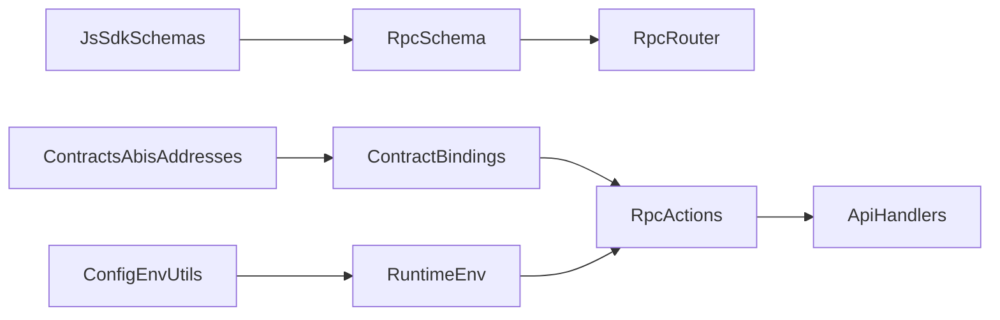

# Onchain Tooling Usage Guidelines

## Goals
- Ensure consistent chain configuration and signing behavior.
- Standardize error decoding and receipt waiting.
- Provide a clean RPC surface that composes app, SDK, and contracts packages.

## Which Document This Content Informs
This content belongs in this document (`ai_docs/improvements/onchain-tooling-usage.md`) because it defines the
boundary between JSON-RPC method naming, internal actions, and typed contract calls.

## RPC Method Taxonomy (Porto-style)
- **Provider/Relay JSON-RPC**: `eth_*`, `wallet_*`, `experimental_*` are JSON-RPC methods that map to internal
  actions, not ABI functions.
- **Contract calls**: ABI functions are encoded into calldata and sent via `eth_sendTransaction` or a call bundle.

This means we do **not** map ABI names directly to RPC method names. RPC methods express
service-level actions, which encode ABI calls internally.

## Monorepo Composition for a Clean RPC API

### Contract sources (ABIs + addresses)
- Use generated ABIs from `packages/contracts/src/generated/contracts.ts`.
- Use the address book from `packages/contracts/src/generated/addresses.ts`.
- Re-export is centralized by `packages/contracts/src/index.ts`.

### SDK schemas (request/response typing)
- Use `packages/js-sdk/src/extensions.ts` for extended payment instrument schemas.
- `packages/js-sdk/index.ts` re-exports the schema surface for consumers.

### Config/env (runtime configuration)
- `packages/config/src/env-utils` provides env loading and schema generation.
- `packages/config/src/path-utils` provides repo/app root resolution.

### Application layer (RPC router + actions)
- API handlers should remain thin and call RPC actions.
- RPC methods should return:
  - typed business results, or
  - EIP-5792 style calls `{to, data, value}` for execution.

## Recommended RPC Surface (Example)

Define a schema that is **service-level**, not ABI-level.

```
merchant_getAccount
merchant_prepareCheckout
merchant_executeCheckout
```

Each method maps to an internal action that builds or executes ABI calls using Viem.

## Contract Binding Pattern (Viem + Abitype)
- Keep ABIs `as const` from generated sources.
- Use `simulateContract` before `writeContract`.
- Use `getContract` for typed methods when possible.

## RPC Router Pattern (Ox)
- Use Ox `RpcSchema.from` to define typed RPC methods.
- Build a router that maps `method` → action handler.
- Actions should be pure and depend on injected clients (public + wallet).

## Suggested Module Layout (Docs Only)
- `apps/samples/rest/nodejs/src/rpc/schema.ts`
- `apps/samples/rest/nodejs/src/rpc/router.ts`
- `apps/samples/rest/nodejs/src/rpc/actions/*.ts`
- `apps/samples/rest/nodejs/src/contracts/bindings.ts`

## Viem Client Setup
- Always define a chain when creating `publicClient` and `walletClient`.
- Ensure `walletClient` uses a local account, not RPC signing.
- Always pass `account` explicitly in `writeContract` if using a local account.

## Transaction Rules
- Always wait for receipts after `approve`, `preApprove`, and `authorize`.
- Use `simulateContract` prior to `writeContract` for predictable failures.

## Error Handling
- Decode errors using ABI for escrow and collectors.
- Surface collector-specific errors such as:
  - `PaymentNotPreApproved`
  - `InsufficientAuthorization`
  - `InvalidSender`

## Abitype + Ox Usage
- Generated ABIs are source-of-truth; do not duplicate ABI fragments.
- Prefer typed contract bindings to avoid incorrect parameter layouts.
- Keep collector-specific data types centralized.

## Anti-Patterns (Avoid)
- Funding accounts from runtime scripts.
- Reading or inferring private keys in the app.
- Cross-package fixture dependencies for runtime scripts.

## Composition Diagram



## References
- `apps/samples/rest/nodejs/src/utils/escrow.ts`
- `apps/samples/rest/nodejs/src/api/checkout.ts`
- `packages/contracts/src/generated/contracts.ts`
- `packages/contracts/src/generated/addresses.ts`
- `packages/js-sdk/src/extensions.ts`
- `packages/config/src/env-utils/index.ts`
